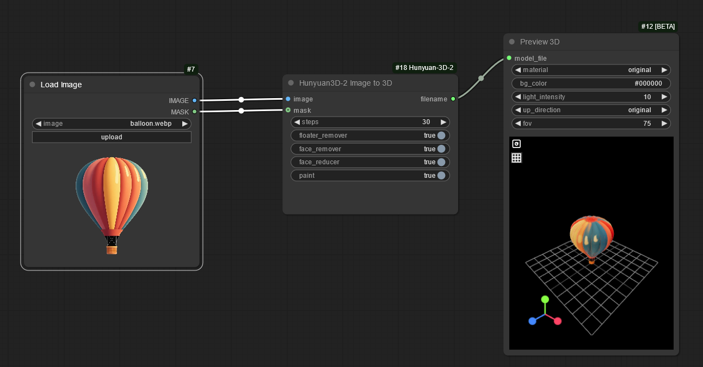

## This is old

Use the custom node one here instead...
[https://github.com/kijai/ComfyUI-Hunyuan3DWrapper](https://github.com/kijai/ComfyUI-Hunyuan3DWrapper)


This is a custom\_node for [ComfyUI](https://github.com/comfyanonymous/ComfyUI).  It converts an image into a 3D file you can import into Blender or whatever 3d software you use.  It uses [Hunyuan-3D-2](https://github.com/Tencent/Hunyuan3D-2) from Tencent.

Make sure you use an image with a transparent background.

This custom node might fail after the first restart.  Restart ComfyUI again.  Click on the panel ~~☐~~ to look for errors.


## If it doesn't install...

You may need to remove the previous version, it doesn't uninstall automatically. `pip uninstall hy3dgen-2.0.0-py3.12.egg`

### Windows

You will need to install [Visual C++ build tools](https://visualstudio.microsoft.com/visual-cpp-build-tools/)

### ComfyUI\_windows\_portable

If you installed ComfyUI with ComfyUI\_windows\_portable, it is using a version of python which is missing the libs and header files.  The way around it is to either copy some folders or install the module from else where. See [issue #3](https://github.com/niknah/ComfyUI-Hunyuan-3D-2/issues/3#issuecomment-2623589325)

If you are getting a ` has no attribute '_get_vc_env'` error.
Run `pip install setuptools==75.8.2` to downgrade setuptools.
See [Issue #148877](https://github.com/pytorch/pytorch/issues/148877)


### Ubuntu 

`sudo apt install python3-dev libgl-dev`

### Suse

Hunyuan-3D needs g++ 13, Suse has g++ 14+ by default

`sudo zypper install g++-13 Mesa-libGL-devel python3-dev`

## Usage...

* [Example workflow](examples/)
* When you run it for the first time it will download the models which will take a long time.  Press the panel button on the top right ~~☐~~ to see the progress.
* Put the input image into the "input" folder.  It must have a transparent background.
* The 3D .glb file is saved in "output" after you run it.

## Workarounds...

* If you get a square panel.  Make sure you have a transparent background in the image.  If the image came from another node, insert an "invert mask" node before giving the mask to this node, some nodes have a mask that's reversed.


### Install from git

Not recommended because ComfyUI-Manager will auto update when you press the update button. git will need manual updates for every custom\_node you have.

```
cd custom_nodes
git clone https://github.com/niknah/ComfyUI-Hunyuan-3D-2
pip install -r requirements.txt
cd ComfyUI-Hunyuan-3D-2
git submodule update --init   # You need to get the submodules if you install from git
```

### Other models...

* Right click on the node, click "convert input to widget", "model".
* connect a string node to the "model" input.
* Put in the string node the ID of the model on hugging face.  ie. tencent/Hunyuan3D-2

* The big model files are downloaded into `~/.cache/huggingface/hub`




### Changes

0.9.6: Added Hunyuan 3D v2.1 support
0.9.4: Added mini, turbo models.
